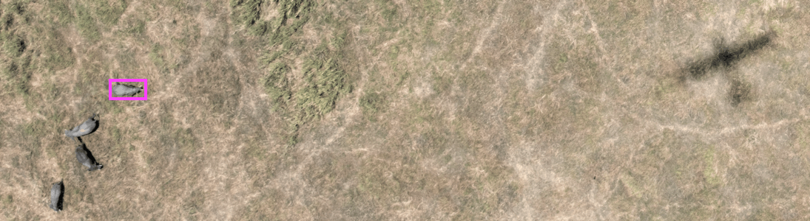

# aerial_survey_ai
Code for object detection in aerial survey images

## Project Description
Our goal is to create an efficient workflow for analyzing images to detect wildlife, livestock, people, and other objects of interest from a large set of aerial survey images collected by the Tanzania Wildlife Research Institute, using AI (deep learning CNN models).  The images have some restrictions on use, and we aim to design a workflow that is open-source, transparent, robust, and can be easily re-used or adapted, while respecting those restrictions.

## Background (HF)
The Tanzania Wildlife Research Institute wants to develop new methods for aerial survey in Africa. One of the more promising developments is the use of digital photography from the same aerial platforms (Cessnas) already in use for wildlife counts - the problem is that _analysing_ the photographs takes far longer than a traditional survey. It is hoped that ML will allow us to more rapidly process the images and make photographic counts viable.

## News/Updates
Just major developments
* 4/17/2020 - Initial data migrated from AWS to Azure (/TA25; annotation file TA25-RKE-20191128A)
* 4/22/2020 - Second annotation file added (TA25-RKE-20191201)
* 4/24/2020 - fastai data loader working

## Code & documentation
Code and documentation are presented in Jupyter Notebooks:

**[Server Setup](https://github.com/jcpayne/aerial_survey_ai/blob/master/server_setup.ipynb)**
- Setup of the Azure server we used, including deep learning libraries

**[Data preparation workflow](https://github.com/jcpayne/aerial_survey_ai/blob/master/data_preparation_workflow.ipynb)**
- Image types and naming conventions
- Migration of files from AWS to Azure
- Creation of UUIDs and database for image security
- Pre-processing of images to convert .NEF to .jpg and adjust contrast, resolution, size

**[Data labeling](https://github.com/jcpayne/aerial_survey_ai/blob/master/data_labeling.ipynb)**
- Labeling process in CVAT 
- A record of decisions regarding image classes, etc.

**[Object detection using AI](https://github.com/jcpayne/aerial_survey_ai/blob/master/tanzania.ipynb)**
- Code for a "Faster R-CNN" model, using fastai2 for data loading and to control training
- Potentially, Detectron2 models either with fastai2 wrapper or directly in PyTorch

### RProject

A `.RProj` file is present for the convenience of fiddling about in R with the various files. The `.gitingore` was also updated to ignore userdata / rdata stuff which would otherwise mess with the git structures (lots of invisible files) - what this means is that you should always re-run code to recreate your local environment if there have been changes (which is good practice anyway).

## References
As needed

## Installation
We could use nbdev to turn some of the notebooks into Python packages, but much of the code/docs won't be directly runnable.

## Contributors
John Payne & Howard Frederick (links, etc.)

## Citation
Please cite this work as follows:
...

## License
- **Code** is open-source (...)
- **Images**  Explain restrictions on image use here
